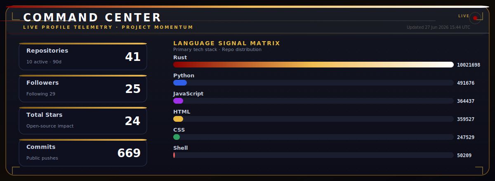
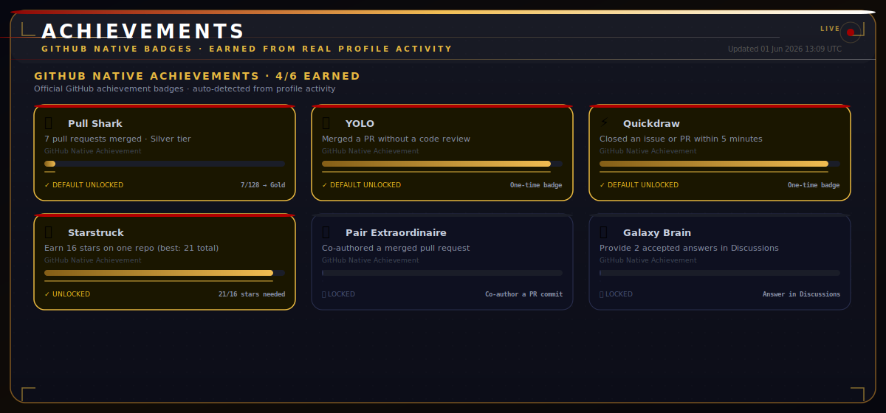
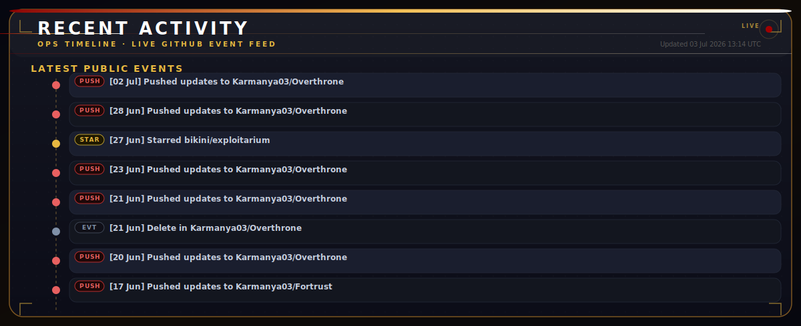
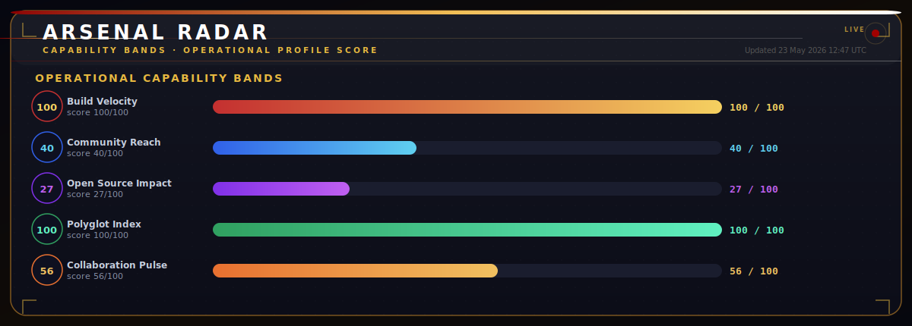

<div align="center">

<!-- ██████████████████████████████████████████████████████████████ -->
<!--                    ANIMATED GIF BANNER                         -->
<!-- ██████████████████████████████████████████████████████████████ -->

[](https://karmanya03-secdev.pro/)

<!-- Holographic name plate -->


<!-- Status badges -->
[](https://karmanya03-secdev.pro/)
[](https://github.com/Karmanya03)

</div>

---

<div align="center">

<!-- ██████████████████████████████████████████████████████████████ -->
<!--                       ABOUT ME                                 -->
<!-- ██████████████████████████████████████████████████████████████ -->

## `> whoami`

</div>

```text
╭───────────────────────────────────────────────────────────────────────╮
│  ▷  OPERATOR_ID  :  Karmanya Ravindra                                 │
│  ▷  CLEARANCE    :  Red Team Professional (CRTP Certified)            │
│  ▷  DIRECTIVE    :  Offensive Security · Secure Engineering           │
│  ▷  SPECIALTIES  :  Game Dev (Unity/Unreal) · XR Development (AR/VR)  │
│  ▷  ARSENAL      :  Rust 🦀 · WebAssembly 🕸️ · C/C++ ⚙️              │
│  ▷  SYS_STATUS   :  [PANIC] Rust compiler won, send coffee...         │
╰───────────────────────────────────────────────────────────────────────╯
```

> *"The quieter you become, the more you can hear."* — Kali Linux

<div align="center">

**B.E. Computer Science & Design** graduate & working as a Software Engineer who loves breaking things (ethically) and building them back stronger.  
Currently crafting **blazingly fast** security tools in **Rust** and hunting for innovative red-team techniques.

[](https://linkedin.com/in/karmanya03)
[](mailto:karmanya03@proton.me)
[](https://tryhackme.com/p/Karmanya03)

</div>

---

<!-- ██████████████████████████████████████████████████████████████ -->
<!--                     COMMAND CENTER                             -->
<!-- ██████████████████████████████████████████████████████████████ -->

## `> stats --live`

<div align="center">



</div>

---

<!-- ██████████████████████████████████████████████████████████████ -->
<!--                       TROPHY CASE                              -->
<!-- ██████████████████████████████████████████████████████████████ -->

## `> trophies --display`

<div align="center">



<!-- GitHub Profile Trophy (onestar theme matches the reference image) -->


</div>

---

<!-- ██████████████████████████████████████████████████████████████ -->
<!--                      ACHIEVEMENTS                              -->
<!-- ██████████████████████████████████████████████████████████████ -->

## `> achievements --unlocked`

<div align="center">



</div>

---

<!-- ██████████████████████████████████████████████████████████████ -->
<!--                       TECH ARSENAL                             -->
<!-- ██████████████████████████████████████████████████████████████ -->

## `> arsenal --list`

<div align="center">

### 〔 LANGUAGES 〕


### 〔 CLOUD · BACKEND · DATA 〕


### 〔 SECURITY · DEVOPS · CREATIVE 〕


</div>

---

<!-- ██████████████████████████████████████████████████████████████ -->
<!--                     RECENT ACTIVITY                            -->
<!-- ██████████████████████████████████████████████████████████████ -->

## `> logs --recent`

<div align="center">



</div>

---

<!-- ██████████████████████████████████████████████████████████████ -->
<!--                      ARSENAL RADAR                             -->
<!-- ██████████████████████████████████████████████████████████████ -->

## `> radar --capability`

<div align="center">



</div>

---

<!-- ██████████████████████████████████████████████████████████████ -->
<!--                     CONTRIBUTION CALENDAR                      -->
<!-- ██████████████████████████████████████████████████████████████ -->

## `> logs --telemetry`

<div align="center">

<picture>
  <source media="(prefers-color-scheme: dark)" srcset="https://github-readme-activity-graph.vercel.app/graph?username=Karmanya03&bg_color=060710&color=d0d8e8&line=8B0000&point=FF0000&area=true&hide_border=true&custom_title=LIVE%20COMMIT%20HEARTBEAT" />
  
</picture>

</div>

---

<div align="center">

<!-- ██████████████████████████████████████████████████████████████ -->
<!--                       FOOTER                                   -->
<!-- ██████████████████████████████████████████████████████████████ -->

```
╔══════════════════════════════════════════════════════════════════╗
║  /dev/null is my inspiration  ·  Rust is my weapon of choice     ║
║  The network is the battlefield  ·  Stay curious, stay paranoid  ║
╚══════════════════════════════════════════════════════════════════╝
```

[](https://github.com/Karmanya03)

*Built with precision · Forged in Rust · Secured by intent*

</div>
